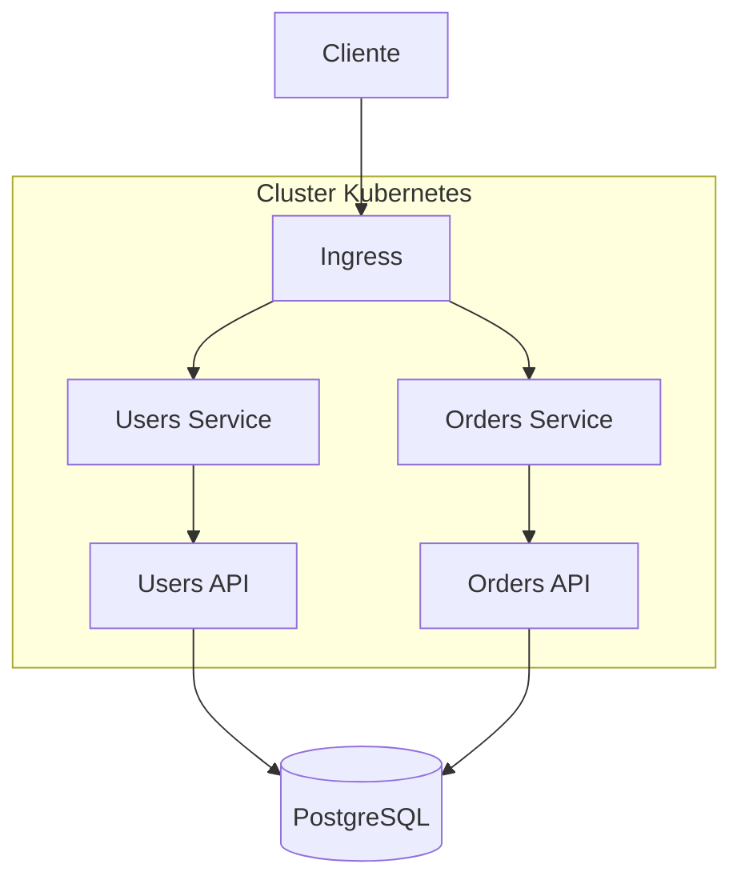
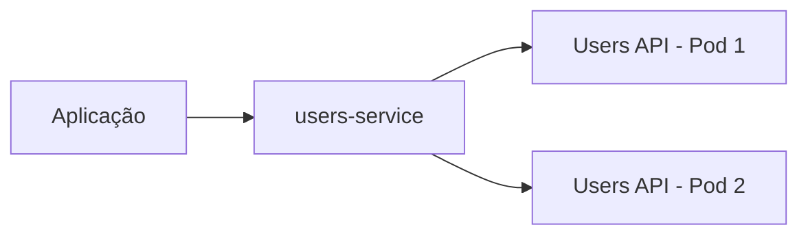
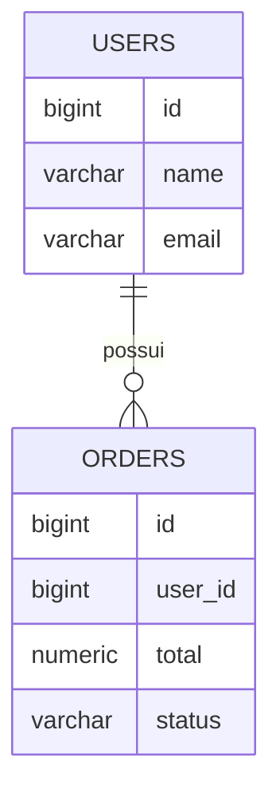

# Cloud Native API Lab

Laboratório prático para construção de uma aplicação **cloud-native**, partindo de um ambiente local com Docker e Kubernetes até sua implantação na Microsoft Azure.

O objetivo do projeto é estudar como diferentes serviços podem funcionar de forma isolada e se comunicar através da rede interna do Kubernetes, evitando a exposição direta das aplicações e de seus endereços internos.

A proposta é evoluir gradualmente essa arquitetura até um ambiente em nuvem com uma camada pública de entrada controlada e os serviços de aplicação e banco de dados protegidos em redes privadas.

## Objetivo do laboratório

A aplicação é composta por serviços independentes responsáveis por diferentes partes do sistema.

Atualmente existem duas APIs:

- **Users API**, responsável pelo gerenciamento de usuários;
- **Orders API**, responsável pelo gerenciamento de pedidos.

Os serviços são executados em containers e orquestrados pelo Kubernetes.

Uma das principais ideias estudadas neste projeto é que os Pods não precisam ser acessados diretamente.

Em vez disso, o Kubernetes fornece uma camada de abstração através de Services e DNS interno.

```text
Pod
 ↓
Service
 ↓
DNS interno do Kubernetes
```

Dessa forma, uma aplicação pode localizar outra pelo nome do serviço, sem precisar conhecer o IP de um Pod.

Isso é importante porque Pods são recursos temporários e seus endereços podem mudar durante reinicializações, atualizações ou substituições realizadas pelo Kubernetes.

## Arquitetura atual

No ambiente local, o Kubernetes é executado através do Minikube.



O cliente não acessa diretamente os Pods das APIs.

As requisições entram pelo **Ingress**, que identifica o destino e encaminha o tráfego para o Service correspondente.

```text
/api/users
     ↓
Ingress
     ↓
users-service
     ↓
Users API


/api/orders
     ↓
Ingress
     ↓
orders-service
     ↓
Orders API
```

Os Services fornecem um endereço estável dentro do cluster enquanto o Kubernetes pode criar, remover ou substituir Pods sem que os consumidores precisem conhecer seus endereços individuais.

## Comunicação interna

Uma parte importante deste laboratório é compreender a diferença entre exposição externa e comunicação interna.

Os Pods possuem seus próprios endereços dentro do cluster, porém esses endereços não são utilizados como pontos fixos de integração.

O Kubernetes fornece nomes DNS para os Services.

Por exemplo:

```text
users-service
orders-service
```

Isso permite que os serviços se comuniquem utilizando nomes conhecidos, enquanto o Kubernetes determina quais Pods estão disponíveis para receber cada requisição.



Essa abstração permite substituir ou recriar Pods sem alterar quem consome o serviço.

## Aplicação

O projeto possui atualmente duas APIs Node.js.

### Users API

Responsável pelos dados dos usuários.

```text
/api/users
```

### Orders API

Responsável pelos pedidos e pelo relacionamento de cada pedido com um usuário.

```text
/api/orders
```

As duas APIs utilizam PostgreSQL para persistência dos dados.



## Containers e Kubernetes

Cada API possui sua própria imagem Docker e é executada independentemente.

No Kubernetes, os principais componentes utilizados até o momento são:

- **Deployment**, responsável por manter as instâncias das aplicações;
- **Pod**, onde os containers são executados;
- **Service**, responsável pelo acesso estável aos Pods;
- **Ingress**, responsável pela entrada HTTP no cluster;
- **ConfigMap**, utilizado para configurações da aplicação;
- **Secret**, utilizado para informações sensíveis;
- **Liveness Probe**, utilizada para verificar se a aplicação continua funcionando;
- **Readiness Probe**, utilizada para determinar se a aplicação está pronta para receber tráfego.

O Kubernetes também permite substituir uma instância da aplicação sem que o consumidor precise conhecer o novo endereço do Pod.

## Segurança

Um dos objetivos principais do projeto é evitar exposição desnecessária dos componentes internos.

O princípio adotado é:

```text
Internet
   │
   ▼
Ponto de entrada controlado
   │
   ▼
Serviços internos
   │
   ▼
Aplicações
   │
   ▼
Banco de dados
```

Os Pods não devem ser tratados como servidores públicos individuais.

A aplicação deve possuir uma camada de entrada definida, enquanto a comunicação entre os componentes internos acontece através da rede do ambiente.

Esse mesmo conceito será levado posteriormente para a Azure.

## Evolução para Azure

O ambiente local serve como base para a arquitetura que será implantada na nuvem.

A arquitetura planejada deverá utilizar serviços como:

- Azure Container Registry;
- Azure Kubernetes Service;
- Azure Database for PostgreSQL;
- Virtual Network;
- sub-redes privadas;
- Application Gateway;
- Web Application Firewall.

A ideia é evoluir de:

```text
Docker + Minikube + PostgreSQL local
```

para:

```text
Azure
│
├── camada pública controlada
│
├── Kubernetes
│   ├── Users API
│   └── Orders API
│
└── PostgreSQL gerenciado
```

mantendo os componentes internos protegidos e expondo apenas aquilo que realmente precisa receber tráfego externo.

## Próximas etapas

O laboratório continuará evoluindo com:

- implementação do CRUD completo de usuários;
- implementação do CRUD completo de pedidos;
- organização interna das APIs em camadas;
- desenvolvimento de uma interface web para consumir as APIs;
- criação das imagens para o ambiente de nuvem;
- publicação no Azure Container Registry;
- implantação no Azure Kubernetes Service;
- utilização do Azure Database for PostgreSQL;
- configuração da rede privada;
- implementação da camada de entrada e proteção com Application Gateway e WAF.

## Tecnologias

- Node.js
- PostgreSQL
- Docker
- Docker Compose
- Kubernetes
- Minikube
- NGINX Ingress Controller
- Microsoft Azure

## Status

O ambiente local já possui as duas APIs executando no Kubernetes e acessando dados persistidos no PostgreSQL.

A próxima fase do projeto será transformar as APIs em serviços CRUD completos e desenvolver um frontend para consumir esses serviços antes da implantação na Azure.