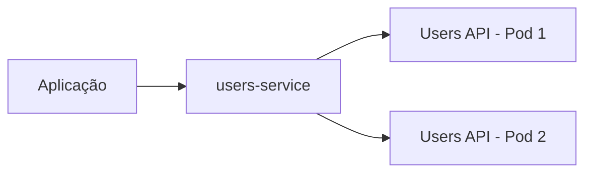
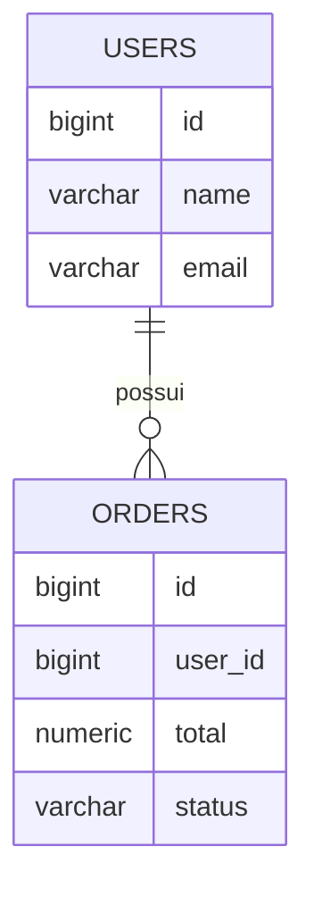

# Cloud Native API Lab

Laboratório prático para construção de uma aplicação **cloud-native**, partindo de um ambiente local com Docker e Kubernetes até sua implantação na Microsoft Azure.

O objetivo do projeto é estudar como diferentes serviços podem funcionar de forma isolada e se comunicar através da rede interna do Kubernetes, evitando a exposição direta das aplicações e de seus endereços internos.

A proposta é evoluir gradualmente essa arquitetura até um ambiente em nuvem com uma camada pública de entrada controlada e os serviços de aplicação e banco de dados protegidos em redes privadas.

## Objetivo do laboratório

A aplicação é composta por serviços independentes responsáveis por diferentes partes do sistema.

Atualmente existem duas APIs:

- **Users API**, responsável pelo gerenciamento de usuários;
- **Orders API**, responsável pelo gerenciamento de pedidos.

Os serviços são executados em containers e orquestrados pelo Kubernetes.

Uma das principais ideias estudadas neste projeto é que os Pods não precisam ser acessados diretamente.

Em vez disso, o Kubernetes fornece uma camada de abstração através de Services e DNS interno.

```text
Pod
 ↓
Service
 ↓
DNS interno do Kubernetes
```

Dessa forma, uma aplicação pode localizar outra pelo nome do serviço, sem precisar conhecer o IP de um Pod.

Isso é importante porque Pods são recursos temporários e seus endereços podem mudar durante reinicializações, atualizações ou substituições realizadas pelo Kubernetes.

## Arquitetura Kubernetes

O ambiente local utiliza Kubernetes através do Minikube para executar e
orquestrar as APIs do projeto.

Cada API possui seu próprio Deployment e Service, com múltiplas réplicas,
health checks e configurações externas através de ConfigMaps e Secrets.

A entrada HTTP do cluster utiliza Kubernetes Gateway API com Envoy Gateway.

```text
                        Cliente
                           |
                           v
                     Envoy Proxy
                           |
                           v
                     Gateway API
                           |
                 +---------+---------+
                 |                   |
          /api/users            /api/orders
                 |                   |
                 v                   v
          users-service        orders-service
                 |                   |
             +---+---+           +---+---+
             |       |           |       |
           Pod       Pod       Pod       Pod
             |                       |
             +-----------+-----------+
                         |
                         v
                     PostgreSQL


## Comunicação interna

Uma parte importante deste laboratório é compreender a diferença entre exposição externa e comunicação interna.

Os Pods possuem seus próprios endereços dentro do cluster, porém esses endereços não são utilizados como pontos fixos de integração.

O Kubernetes fornece nomes DNS para os Services.

Por exemplo:

```text
users-service
orders-service
```

Isso permite que os serviços se comuniquem utilizando nomes conhecidos, enquanto o Kubernetes determina quais Pods estão disponíveis para receber cada requisição.



Essa abstração permite substituir ou recriar Pods sem alterar quem consome o serviço.

## Aplicação

O projeto possui atualmente duas APIs Node.js.

### Users API

Responsável pelos dados dos usuários.

```text
/api/users
```

### Orders API

Responsável pelos pedidos e pelo relacionamento de cada pedido com um usuário.

```text
/api/orders
```

As duas APIs utilizam PostgreSQL para persistência dos dados.



## Containers e Kubernetes

Cada API possui sua própria imagem Docker e é executada independentemente.

No Kubernetes, os principais componentes utilizados atualmente são:

- **Deployment**, responsável por manter o estado desejado e as réplicas das aplicações;
- **Pod**, onde os containers das APIs são executados;
- **Service**, responsável por fornecer acesso estável aos Pods;
- **GatewayClass**, responsável por definir a implementação utilizada pelos Gateways;
- **Gateway**, responsável por representar o ponto de entrada de tráfego HTTP;
- **HTTPRoute**, responsável por definir as regras de roteamento para os Services;
- **ConfigMap**, utilizado para configurações não sensíveis da aplicação;
- **Secret**, utilizado para informações sensíveis;
- **Liveness Probe**, utilizada para verificar se a aplicação continua funcionando;
- **Readiness Probe**, utilizada para determinar se a aplicação está pronta para receber tráfego.

Os Deployments mantêm múltiplas réplicas das APIs e permitem que novas versões
sejam implantadas progressivamente através de Rolling Updates.

Os Services fornecem endereços estáveis para as aplicações, evitando que
consumidores ou componentes de roteamento precisem conhecer diretamente os
endereços IP dos Pods.

A arquitetura de entrada HTTP utiliza Kubernetes Gateway API com Envoy Gateway:

```text
Cliente
   │
   ▼
Envoy Proxy
   │
   ▼
Gateway API
   │
   └── HTTPRoute
       ├── /api/users  → users-service  → Users Pods
       └── /api/orders → orders-service → Orders Pods
                                      │
                                      ▼
                                  PostgreSQL
```

### Migração do Ingress-NGINX para Gateway API

O laboratório utilizava inicialmente Kubernetes Ingress com o controlador
Ingress-NGINX.

Durante o desenvolvimento e os estudos relacionados à arquitetura Kubernetes,
foi identificada a aposentadoria oficial do Ingress-NGINX em março de 2026.

Como o controlador deixou de receber novas versões, correções de bugs e
atualizações para futuras vulnerabilidades de segurança, foi decidido migrar
a camada de entrada do laboratório para Kubernetes Gateway API.

Para o ambiente local foi adotado o Envoy Gateway como implementação da
Gateway API.

A migração foi realizada mantendo temporariamente as duas soluções em paralelo.
Após a validação das operações GET, POST, PUT e DELETE através da nova camada,
o Ingress-NGINX foi removido do ambiente.

Os detalhes e motivos dessa decisão estão registrados em:

`docs/adr/001-migracao-ingress-nginx-para-gateway-api.md`

## Segurança

Um dos objetivos principais do projeto é evitar exposição desnecessária dos
componentes internos.

O princípio adotado é:

```text
Internet
   │
   ▼
Ponto de entrada controlado
   │
   ▼
Gateway / Roteamento
   │
   ▼
Services
   │
   ▼
Aplicações
   │
   ▼
Banco de dados
```

Os Pods não devem ser tratados como servidores públicos individuais.

A aplicação possui uma camada de entrada definida, enquanto a comunicação com
os workloads acontece através dos Services do Kubernetes.

Esse mesmo princípio será levado posteriormente para a arquitetura na
Microsoft Azure, mantendo os componentes internos protegidos e expondo apenas
os serviços que realmente precisam receber tráfego externo.

## Evolução para Azure

O ambiente local serve como base para a arquitetura que será implantada na
nuvem.

A arquitetura planejada deverá utilizar serviços como:

- Azure Container Registry (ACR);
- Azure Kubernetes Service (AKS);
- Azure Database for PostgreSQL;
- Virtual Network;
- sub-redes privadas;
- Application Gateway;
- Web Application Firewall (WAF).

A ideia é evoluir de:

```text
Docker
   │
Minikube
   │
Gateway API + Envoy Gateway
   │
APIs
   │
PostgreSQL local
```

para uma arquitetura em Azure:

```text
Azure
│
├── camada pública controlada
│
├── Application Gateway / WAF
│
├── Kubernetes (AKS)
│   ├── Users API
│   └── Orders API
│
└── PostgreSQL gerenciado
```

A implementação definitiva da camada de entrada no Azure será definida de
acordo com a arquitetura e os serviços gerenciados adotados na etapa de
implantação em nuvem.

## Próximas etapas

O laboratório continuará evoluindo com:

- desenvolvimento de uma interface web para consumir as APIs;
- criação da imagem Docker do frontend;
- execução do frontend no Kubernetes;
- integração do frontend com `/api/users` e `/api/orders`;
- publicação das imagens no Azure Container Registry;
- implantação das aplicações no Azure Kubernetes Service;
- utilização do Azure Database for PostgreSQL;
- configuração da rede privada;
- implementação da camada de entrada e proteção no Azure com Application
  Gateway e WAF.

## Tecnologias

- Node.js
- Express
- PostgreSQL
- Docker
- Docker Compose
- Kubernetes
- Minikube
- Kubernetes Gateway API
- Envoy Gateway
- Helm
- Microsoft Azure

## Status

O backend do ambiente local está funcional e executando no Kubernetes.

As APIs de usuários e pedidos possuem operações CRUD completas, persistência
em PostgreSQL, múltiplas réplicas, Services, ConfigMaps, Secrets, Liveness
Probes, Readiness Probes e suporte a Rolling Updates.

A entrada HTTP do cluster utiliza Kubernetes Gateway API com Envoy Gateway.
As rotas `/api/users` e `/api/orders` foram validadas através da nova
arquitetura, incluindo operações GET, POST, PUT e DELETE.

O Ingress-NGINX utilizado inicialmente no laboratório foi removido após a
migração e validação da Gateway API.

A próxima etapa do projeto será o desenvolvimento do frontend para consumir
as APIs antes da implantação da solução na Microsoft Azure.

O ambiente local já possui as duas APIs executando no Kubernetes e acessando dados persistidos no PostgreSQL.

A próxima fase do projeto será transformar as APIs em serviços CRUD completos e desenvolver um frontend para consumir esses serviços antes da implantação na Azure.